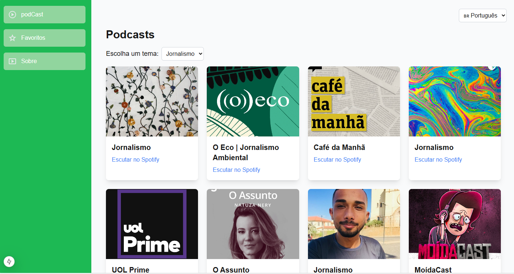

# Podcast Finder

Podcast Finder é uma aplicação web que permite aos usuários descobrir, ouvir e organizar seus podcasts favoritos. Integrada com a API do Spotify, a plataforma oferece uma experiência simples e intuitiva para explorar conteúdos de áudio de diversos gêneros.

## Funcionalidades

- **Tela Inicial:** Exibe uma lista de podcasts populares para o usuário explorar.
- **Favoritos:** O usuário pode adicionar podcasts à sua lista de favoritos para acessá-los rapidamente.
- **Sobre:** A aplicação conta com uma seção de "Sobre" para informações e créditos.

## Tecnologias Utilizadas

- **Frontend:** React, Next.js
- **Estilização:** CSS (TailwindCSS ou outra biblioteca de sua escolha)
- **API:** Spotify API
- **Gerenciamento de estado:** Context API ou React Hooks

## Rotas

### `/`
A página inicial exibe uma lista de podcasts populares, com a opção de adicionar à lista de favoritos.

### `/favorites`
Exibe a lista de podcasts que o usuário marcou como favoritos.

### `/about`
Rota sobre a aplicação, onde são apresentadas informações sobre o Podcast Finder, como seu propósito e funcionalidades.

### Tela Inicial



## A aplicação estará disponível em `http://localhost:3000`.

### Esta aplicação foi desenvolvida por Bruno Giomes e Cicera Ribeiro

## Como Rodar o Projeto

    ```bash
### 1. Clone o repositório
    git clone https://github.com/Cicera1987/podcast-finder.git

### 2. Instale as dependências
    npm install

### 3. Rode o Projeto
    npm run dev


 

